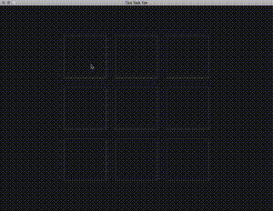

# Tick Tack Toe

This project is a Tick Tack Toe game that I made on a sick day at home in 4 hours.

It was made with GameMaker Studio 2 when I found out you can play around with it for free, but if you want to publish a game then you need to buy it.
https://www.yoyogames.com/gamemaker

I'm pretty impressed with how quick it was to learn.  The hardest part was figuring out how to make functions, and how you can reference instances.  Basically every instance is global, and every resource is global, that's how you reference things.  And to make a new function you need to make a new script.  Then argument0, argument1 ... are the input params to the function.

The "art" was made in GameMaker, and the sounds were made by scratching my nail on the computer's side while recording in Quicktime Player.
